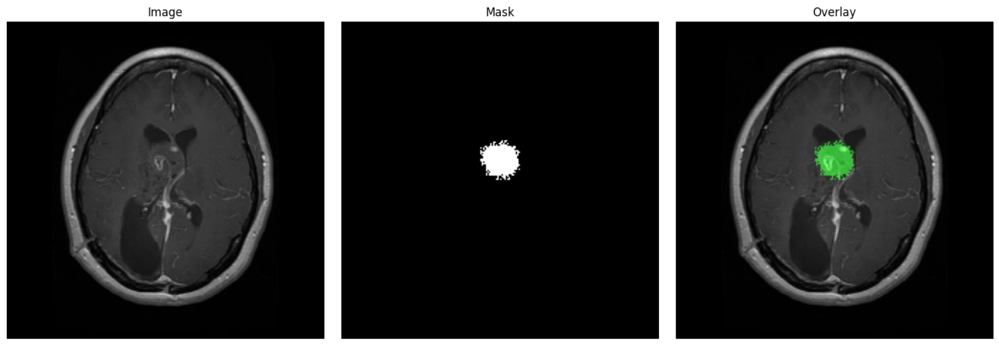
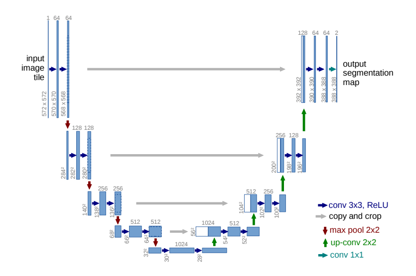
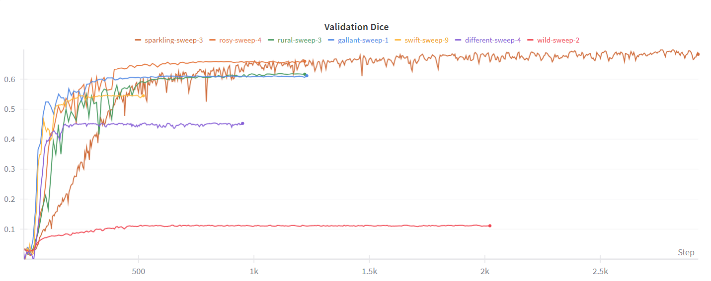
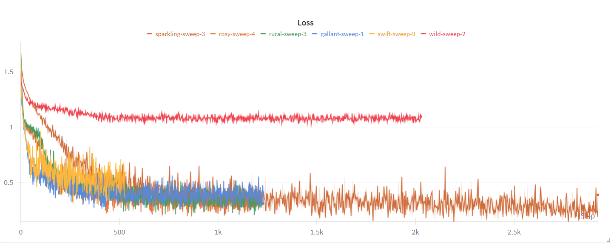

# Brain Tumor Segmentation using U-Net

This repository implements a deep learning pipeline for **brain tumor segmentation** using a **custom U-Net architecture** built with PyTorch.  
All configurations such as dataset paths, image size, learning rate, and batch size are defined in a `config.yaml` file — no code modifications are required to change experiment parameters.

---

## Table of Contents
- [Overview](#overview)
- [Key Features](#key-features)
- [Configuration](#configuration)
- [Model Architecture](#model-architecture)
- [Training Pipeline](#training-pipeline)
- [Hyperparameter Tuning](#hyperparameter-tuning)
- [Results](#results)
- [Visualizations](#visualizations)
- [Installation and Usage](#installation-and-usage)
- [Future Work](#future-work)
- [Acknowledgements](#acknowledgements)

---

## Overview



This project performs **semantic segmentation** on brain MRI scans to detect and localize tumors.  
A **U-Net** model is trained from scratch using **Dice Loss** and evaluated using the **Dice Coefficient** metric.  
Training is optimized with **Automatic Mixed Precision (AMP)** for reduced memory consumption and faster computation.  
Hyperparameters such as learning rate, batch size, and U-Net feature depth are tuned automatically using **Weights & Biases (W&B) sweeps**.

**Objective:** Accurately predict tumor masks and improve the validation Dice coefficient

---

## Key Features

- Modular design controlled via `config.yaml`
- Custom PyTorch Dataset for image–mask pairs
- Automatic creation of train, validation, and test DataLoaders
- U-Net model with tunable encoder feature sizes
- Custom **Dice Loss** and **Dice Coefficient** metric
- **Early Stopping** implemented from scratch
- **AMP (Automatic Mixed Precision)** training for efficiency
- **W&B integration** for:
  - Logging losses, metrics, and gradients
  - Visualizing predicted masks
  - Saving model checkpoints and sweeps
- **W&B Sweeps** for automated hyperparameter tuning
- Validation Dice improved from 0.10 to 0.65

---

## Configuration

All paths, hyperparameters, and training options are defined in the `configs/` directory.  
- `config.yaml` – main parameters for dataset, model, and training.  
- `sweep.yaml` – configuration for Weights & Biases hyperparameter sweeps.  

Changes in these files automatically update the pipeline without modifying any code.


---

## Model Architecture

The segmentation model is based on the **U-Net architecture**, which is widely used for medical image segmentation tasks due to its ability to capture both local and global context. The model follows an **encoder-decoder structure** with skip connections:

- **Encoder (Contracting Path):**  
  The encoder consists of sequential convolutional blocks, each containing two convolution layers followed by ReLU activations. Each block is followed by a max-pooling layer that downsamples the feature maps by a factor of 2. The number of feature channels doubles after each downsampling step, allowing the network to capture increasingly abstract features.  

- **Bottleneck:**  
  The bottleneck connects the encoder and decoder and consists of two convolutional layers with the highest number of feature channels. This layer captures the most abstract representation of the input image.

- **Decoder (Expanding Path):**  
  The decoder mirrors the encoder. Each upsampling block first upsamples the feature maps (using transpose convolution or bilinear upsampling), then concatenates the corresponding feature maps from the encoder via skip connections. Two convolutional layers with ReLU follow each concatenation. This structure preserves spatial information while allowing the network to recover fine details.

- **Skip Connections:**  
  Skip connections from encoder to decoder help retain spatial information lost during downsampling. This is crucial for accurate segmentation, especially for small and irregularly shaped tumors.

- **Output Layer:**  
  The final layer uses a 1×1 convolution to reduce the feature channels to the required output channels (1 for binary tumor mask). A Sigmoid activation is applied to produce pixel-wise probabilities between 0 and 1.

- **Configurable Features:**  
  The number of features in each encoder block is fully configurable via `config.yaml`, allowing experimentation with model depth and capacity.

**Diagram of U-Net Architecture:**

<p align="center">
  
</p>


This architecture enables precise segmentation even with limited training data, making it ideal for brain tumor MRI scans.


---

## Training Pipeline

The training pipeline is designed to be modular, efficient, and fully configurable via `config.yaml`. The following steps outline the complete workflow:

1. **Configuration Loading:**  
   All paths, model parameters, training settings, and hyperparameters are loaded from `config.yaml` and used to initialize datasets, model, optimizer, and training loops.

2. **Data Preparation:**  
   - The `dataset.py` class provides paired images and masks using the `__getitem__` method.  
   - `datamodule.py` creates DataLoaders for train, validation, and test splits.  
   - Dataset paths, batch size, and validation split are configurable.  
   - `transforms.py` handles image augmentations and preprocessing for both training and validation sets.

3. **Model Initialization:**  
   - The U-Net model is instantiated with configurable input/output channels .  
   - Model weights are initialized from scratch.

4. **Optimizer Selection:**  
   - The optimizer is dynamically selected from the `optimizer.py` utility based on the W&B sweep values.  
   - Common options include Adam, SGD.

5. **Loss Function:**  
   - Training uses **custom Dice Loss** implemented in `loss.py`.  
   - Dice coefficient is computed for evaluation and logged during training.

6. **Mixed Precision Training (AMP):**  
   - Automatic Mixed Precision is used to accelerate training and reduce GPU memory consumption.  
   - This allows using larger batch sizes or higher feature depths without running out of memory.

7. **Training Loop:**  
   - For each epoch, the model is trained on batches from the training DataLoader.  
   - Loss, Dice coefficient, and gradients are computed and optionally logged to W&B.  
   - Predicted masks are saved periodically for inspection.

8. **Validation and Early Stopping:**  
   - After each epoch, the model is evaluated on the validation set.  
   - Early stopping is applied from `earlystopping.py` to halt training if the validation Dice coefficient does not improve for a predefined number of epochs.

9. **Logging and Checkpoints:**  
   - All metrics, losses, model weights, and predicted masks are logged using **Weights & Biases (W&B)**.  
   - Checkpoints are saved for the best performing models based on validation Dice score.

10. **Result Tracking:**  
    - The training process logs both quantitative metrics (Dice, loss, accuracy) and qualitative outputs (predicted masks vs ground truth) for easy analysis.

This pipeline ensures **reproducible, memory-efficient, and high-performing segmentation training** with minimal manual intervention.


---

## Hyperparameter Tuning

Hyperparameter tuning is performed using **Weights & Biases (W&B) Sweeps**, which automates the search for optimal parameters to improve model performance. The following explains the setup and workflow:

1. **Sweep Configuration (`sweep.yaml`):**  
   - Defines the hyperparameters to search, such as learning rate, batch size, and the number of features in U-Net layers.  
   - Specifies the search method (grid, random, or Bayesian) and the metric to optimize (validation Dice coefficient).  

2. **Parameters Tuned:**  
   - **Learning Rate (`lr`):** Controls the step size of the optimizer. Tested values typically range from 0.0001 to 0.001.  
   - **Batch Size:** Impacts memory usage and gradient estimation. Tested values depend on GPU capacity.  
   - **Number of Features in U-Net:** Adjusting the encoder/decoder channel sizes affects model capacity and segmentation performance.

3. **Sweep Execution:**  
   - The sweep agent reads `sweep.yaml` and launches multiple training runs with different hyperparameter combinations.  
   - Each run initializes the model, optimizer, and training pipeline automatically using values from the sweep configuration.


## Results

### Validation Dice

The Dice coefficient improved significantly during training, from **0.10** initially to **0.65** at the end.  
This shows that the model learned to segment tumor regions accurately.  



### Validation Loss

The validation loss decreased from **1.08** to **0.20**, indicating that the model predictions became much closer to the ground truth masks over time.  




---

## Visualizations

### Predicted vs Ground Truth Masks

Below are examples of **ground truth masks** and their corresponding **predicted masks** displayed side by side:

<div style="display: flex; gap: 10px;">
  <div>
    <p>Ground Truth</p>
    
  </div>

  <div>
    <p>Predicted Mask</p>
    
  </div>
</div>


---

## Installation and Usage

### Clone the Repository
```bash
git clone https://github.com/hald-har/Brain-Tumor-Segmentation.git
cd U-Net
```
-Update the dataset paths and other parameters in configs/config.yaml as needed.


```bash
pip install -r requirements.txt

wandb login
wandb sweep configs/sweep.yaml
wandb agent <sweep_id>

```


